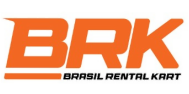

# Brasil Rental Karts 🏎️



A comprehensive platform for managing rental kart leagues in Brazil. Providing professional tools for championship organization, pilot management, and result tracking.

[](#proprietary-license)
[](https://nextjs.org/)
[](https://reactjs.org/)
[](https://tailwindcss.com/)

## 🎯 Overview

Brasil Rental Karts (BRK) is a digital solution developed to meet the specific needs of the rental kart market in Brazil. The platform enables league organizers to create and manage competitions professionally, while pilots can maintain their profiles, track results, and connect with the community.

## ✨ Key Features

### For League Organizers
- Championship creation and management
- Pilot registration management
- Automatic scoring system
- Race results recording
- Rankings and statistics publication

### For Pilots
- Customizable profile creation
- Complete results history
- Performance statistics
- Community ranking
- Competition discovery

### Connected Community
- Result sharing
- Championship discovery
- Cross-league integration
- Pilot networking

## 🛠️ Tech Stack

- **Frontend**: Next.js 15 with React 19
- **Styling**: TailwindCSS 4 with custom design system
- **UI Components**: Based on shadcn/ui library
- **Icons**: Lucide React
- **Forms**: React Hook Form with Zod validation
- **Design System**: Proprietary system with customizable theme and light/dark mode

## 📋 Prerequisites

- Node.js 18 or higher
- npm, yarn, pnpm, or bun

## 🚀 Getting Started

### Installation

```bash
# Clone the repository
git clone https://github.com/wernerjr/brasil-rental-karts.git
cd brasil-rental-karts

# Install dependencies
npm install
# or
yarn install
# or
pnpm install
# or
bun install
```

### Development Environment

```bash
npm run dev
# or
yarn dev
# or
pnpm dev
# or
bun dev
```

Access [http://localhost:3000](http://localhost:3000) in your browser to view the application.

## 🧪 Quality and Testing

```bash
# Start development server
npm run dev

# Build for production
npm run build

# Start production server
npm run start

# Run linting
npm run lint
```

## 📁 Project Structure

```
brasil-rental-karts/
├── public/           # Static files (images, favicon, etc.)
├── src/              # Source code
│   ├── app/          # Application pages (Next.js App Router)
│   ├── components/   # Reusable components
│   │   ├── layout/   # Layout components (navbar, footer, etc.)
│   │   └── ui/       # UI components (buttons, cards, etc.)
│   └── lib/          # Utilities and helper functions
└── ...               # Configuration files
```

## 💼 Business Model

### League Organizer Plans
- **Free**: Single league management, up to 20 pilots
- **Professional**: Multiple league management, up to 100 pilots, advanced statistics
- **Enterprise**: Custom solution for large leagues with specific needs

### Pilot Plans
- **Free**: Basic profile and league participation
- **Premium**: Advanced statistics, complete history, and exclusive features

## 🔒 Proprietary License

This project is private and proprietary. All code, design, and content are protected by copyright and may not be copied, modified, or distributed without express authorization. Access to this repository is restricted to authorized collaborators only.

## 🤝 Contributing

For authorized collaborators:
1. Create a feature branch (`git checkout -b feature/AmazingFeature`)
2. Commit your changes (`git commit -m 'Add some AmazingFeature'`)
3. Push to the branch (`git push origin feature/AmazingFeature`)
4. Create a Pull Request

## 📞 Support

For support and inquiries:
1. Check existing issues
2. Create a new issue with detailed description
3. Contact the development team through official channels

---

Made with ❤️ for the Brazilian karting community