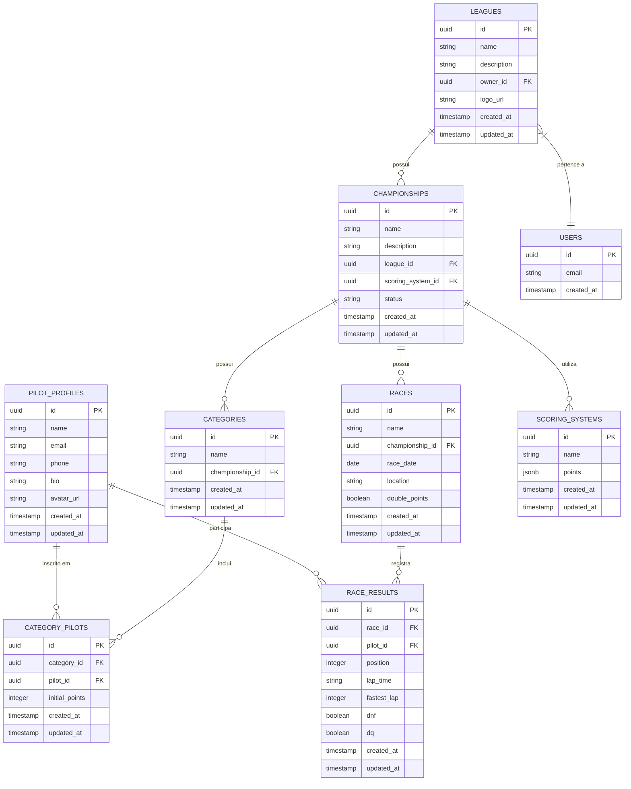

# Diagrama de Entidade-Relacionamento - Brasil Rental Karts

Este documento apresenta o diagrama de entidade-relacionamento (ER) do sistema Brasil Rental Karts, ilustrando as principais entidades, seus atributos e relacionamentos.

## Diagrama ER

## Descrição das Entidades

### PILOT_PROFILES
Armazena informações dos pilotos cadastrados no sistema.

### LEAGUES
Representa as ligas de kart, que são criadas e gerenciadas por usuários.

### CHAMPIONSHIPS
Campeonatos organizados dentro de uma liga, com sistema de pontuação específico.

### CATEGORIES
Categorias dentro de um campeonato, permitindo a divisão de pilotos por nível ou critérios específicos.

### CATEGORY_PILOTS
Tabela de relacionamento entre categorias e pilotos, registrando a inscrição de pilotos em categorias específicas.

### RACES
Corridas ou etapas de um campeonato, com data, local e possibilidade de pontuação em dobro.

### RACE_RESULTS
Resultados individuais de cada piloto em uma corrida, incluindo posição, tempo de volta, volta mais rápida e status (DNF, DQ).

### SCORING_SYSTEMS
Sistemas de pontuação que podem ser aplicados aos campeonatos, definindo pontos por posição.

### USERS
Usuários do sistema, vinculados ao sistema de autenticação do Supabase.

## Relacionamentos Principais

1. Um piloto (PILOT_PROFILES) pode participar de várias corridas (RACE_RESULTS)
2. Um piloto pode estar inscrito em várias categorias (CATEGORY_PILOTS)
3. Uma liga (LEAGUES) pertence a um usuário (USERS) e pode ter vários campeonatos (CHAMPIONSHIPS)
4. Um campeonato possui várias categorias, corridas e utiliza um sistema de pontuação
5. Uma categoria inclui vários pilotos através da tabela CATEGORY_PILOTS
6. Uma corrida registra vários resultados de pilotos

Este diagrama ER representa a estrutura de dados fundamental do sistema Brasil Rental Karts, ilustrando como as diferentes entidades se relacionam para suportar a gestão completa de ligas, campeonatos, categorias, pilotos e resultados de corridas.